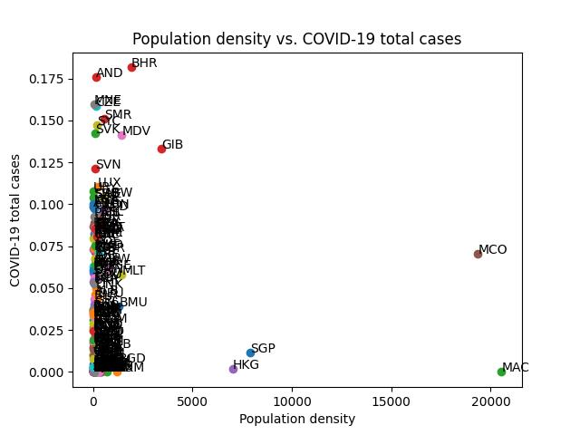

# pion

## Task
The time is 2021.06.30. COVID is still in a global pandemic state.
An anonymous billionaire has contacted Pion Corp.
"I have acquired 1 million doses of COVID vaccine.
I don't want to sell these.
I don't want to waste them either.
What would be the most effective way to distribute them? "

As a data scientist at Pion Corp, you are tasked with providing the best way to fulfill the client's needs.
The report will be titled, "The DATA SCIENTIFIC way of distributing COVID vaccine".

1. Please define the OBJECTIVE clearly. Why should the billionaire agree that this objective is important? Explain it with "first principle" thinking.
2. What should we do with the vaccine? What are the "action items" with What, When, Where.
3. What is the expected impact by #2:action on #1:Objective? e.g. "the rocket should go in orbit" (x). "the rocket will reach 1000km altitude at 130 sec, and 2000km at 170 sec, cruising at 8000km/h, with 33% fuel left."(o)
4. (extra credit:) If the billionaire does not have the vaccine now, but will receive it in 2 months (2021.08.31). How should the #2:action change? How can we know that your prediction is accurate?

## Report
코로나 백신을 가장 영향력있게 쓰는 방법은 코로나 감염자 수를 최소화 시키는 것 입니다.
백신을 맞는 이유는 코로나를 예방할 확률을 높이기 위해서이고, 코로나에 확진 되는 경로는 대부분 사람 매개체를 통해서이기 때문에, 인구 밀도 대비 백신 접종자 인구가 가장 적은 곳 부터 백신을 분배하는 것이 코로나 확산을 최소화 시킬 수 있는 방법이라고 생각하기 쉽습니다.
하지만, 연구 결과와 통계에 따르면 인구 밀도와 확진자 수 사이의 상관관계는 진실이 아니라고 나타나고 있습니다.

오히려 인구 수가 적더라도 의료 접근권이 부족하고, 낮은 접종률 탓에 시골에서 감염이 더 빠르게 확산되고 있는 걸로 보여집니다.
코로나 감염자 수를 최소화 시키기 위해서는, 의료 인프라가 적게 분포되어있는 나라에 백신을 공급하는 것이 가장 효과적이라고 보입니다.

첫번째로 각 나라 별, 날짜 별 코로나 확진자 수 통계 자료와 인구 밀도 대비 백신 미 접종자 수를 찾고, 이에 따른 일별 백신 사용량을 예측합니다.
예측이 완료되면 해당 나라의 백신 보유량을 파악하고, 일 단위로 필요한 만큼 순서대로 분배합니다.
일 단위로 선택한 이유는 2021년 6월 30일 기준, 전 세계적으로 코로나 백신 신규 접종자 수가 약 3800만 명인 것을 감안하여 현재 백신 100만개는 하루 안에 모두 소진할 수 있다고 생각하기 때문입니다. (출처: https://insfiler.com/detail/rt_corona19vacc_bycountry-0001)

분배 방법을 정할 수 있는 다른 방법은 각 나라의 백신 접종 속도와 확진 속도를 비교하여, 가장 확진세가 빠를 것 같은 나라에 공급하는 것입니다.

위에 적은 기준에 따라 백신을 분배할 경우, 

만약 두 달 후에 백신을 받을 경우, 백신 미 접종자 수의 증가율을 logarithmic graph의 기울기를 계산하여 분배할 것 같습니다.

## 실행 방법
1. 데이터 베이스 설치
`docker-compose -f docker-compose-db.yml up -d`

2. requirements 설지
`pip install -r requirements.txt`

3. 코드 실행
`python core/main.py`

## 출처
- owid-covid-data.json: https://github.com/owid/covid-19-data/tree/master/public/data
- https://www.ncbi.nlm.nih.gov/pmc/articles/PMC8253654/
- https://factcheck.snu.ac.kr/facts/show?id=3493